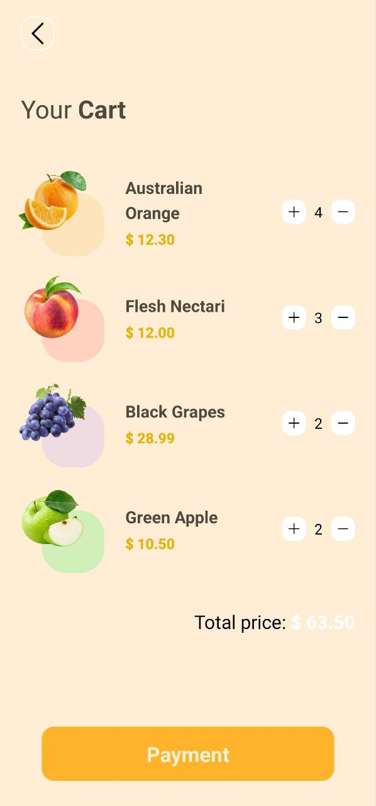

# Fruit App Ui React Native

## Preview Final Project

#### Home Screen


#### Product Screen


#### Cart Screen




## What did we use in the project?
### 1- [React Native Expo](https://reactnative.dev/)
### 2- [NativeWind](https://www.nativewind.dev/)
### 3- [React Navigation](https://reactnavigation.org/)
### 4- [npm react-native-heroicons](https://www.npmjs.com/package/react-native-heroicons)

## Steps
- npx create-expo-app fruit-App-Ui
- npm i nativewind
- npm i --dev tailwindcss@3.3.2
- npx tailwindcss init
- npm install @react-navigation/native
- npx expo install react-native-screens react-native-safe-area-context
- npm install @react-navigation/native-stack
- npm i react-native-responsive-screen
- npm i react-native-heroicons
- npm i react-native-heroicons react-native-svg
- npm i react-native-star-rating
- npm i deprecated-react-native-prop-types@2.2.0
- npx expo install --fix
- npx expo install
- expo install --fix
```
// tailwind.config.js
module.exports = {
- content: [],
+ content: ["./App.{js,jsx,ts,tsx}", "./<custom directory>/**/*.{js,jsx,ts,tsx}"],
  theme: {
    extend: {},
  },
  plugins: [],
}

  content: [
    "./App.{js,jsx,ts,tsx}", 
    "./screens/**/*.{js,jsx,ts,tsx}",
    "./components/**/*.{js,jsx,ts,tsx}"
  ],

3. Add the Babel plugin

Modify your babel.config.js

// babel.config.js
module.exports = function (api) {
  api.cache(true);
  return {
    presets: ["babel-preset-expo"],
+   plugins: ["nativewind/babel"],
  };
};
```

## Run The Project
- Download
- Open The Project
- Terminal
- npm i
- npx expo
- -w or Open Expo App On your Phone


## Error
ERROR  ViewPropTypes will be removed from React Native, along with all other PropTypes. We recommend that you migrate away from PropTypes and switch to a type system like TypeScript. If you need to continue using ViewPropTypes, migrate to the 'deprecated-react-native-prop-types' package.

          - npm i deprecated-react-native-prop-types@2.2.0

* Package react-star-ratings `deprecated`
- https://www.npmjs.com/package/react-star-ratings
- use react-native-star-rating-widget
